# Mini Aplicación Web - Agenda

## 📌 Información del Proyecto

* **Institución:** Instituto Tecnológico Superior de Lerdo
* **Carrera:** Ingeniería Informática
* **Materia:** Desarrollo de Aplicaciones Web
* **Docente:** Ing. Jesús Salas Marín
* **Alumno:** Ana Maria Villegas Valenzuela
* **Proyecto:** Mini Aplicación Web - Agenda

---

# 📖 Descripción General

Este proyecto consiste en una mini aplicación web desarrollada en PHP que permite registrar usuarios, contactos y citas mediante formularios HTML conectados a una base de datos MySQL.

La aplicación fue diseñada utilizando arquitectura cliente-servidor y una estructura organizada por carpetas para separar la lógica del sistema.

---

# 🎯 Objetivo

Desarrollar una aplicación web funcional que permita gestionar usuarios, contactos y citas utilizando tecnologías web básicas como PHP, HTML, JavaScript y MySQL.

---

# 🛠 Tecnologías Utilizadas

* PHP
* HTML5
* JavaScript
* MySQL / MariaDB
* XAMPP
* GitHub

---

# 📂 Estructura del Proyecto

```bash id="v1zx3g"
/proyecto_web
│
├── /config
│   ├── conexion.php
│   └── arreglar.php
│
├── /php
│   ├── registro_usuario.php
│   ├── registro_contacto.php
│   └── registro_cita.php
│
├── /views
│   ├── registro.html
│   ├── contactos.html
│   └── citas.html
│
├── index.php
└── info.php
```

---

# 🔐 Seguridad Implementada

El sistema incluye medidas básicas de seguridad:

* Validación de formularios con JavaScript
* Uso de método POST
* Protección de contraseñas mediante SHA1
* Validación de campos vacíos
* Restricción de acceso a scripts PHP

---

# 👤 Registro de Usuarios

El módulo de usuarios permite:

* Registrar nuevos usuarios
* Guardar nombre, correo y contraseña
* Encriptar contraseñas con SHA1

---

# 📞 Registro de Contactos

Este módulo permite almacenar contactos asociados a cada usuario.

## Funciones

* Registrar nombre
* Registrar teléfono
* Relacionar contacto con usuario mediante usuario_id

---

# 📅 Registro de Citas

Este apartado permite registrar citas personales.

## Funciones

* Guardar fecha
* Guardar descripción
* Asociar cita al usuario

---

# 🗄 Base de Datos

La base de datos contiene tres tablas principales:

* usuarios
* contactos
* citas

Las tablas contactos y citas están relacionadas mediante llaves foráneas.

---

# ⚙ Funcionamiento del Sistema

1. El usuario entra a index.php
2. Selecciona una opción del menú
3. Llena el formulario
4. Los datos son enviados mediante POST
5. PHP procesa la información
6. Los datos se almacenan en MySQL

---

# 🚀 Cómo Ejecutar el Proyecto

1. Instalar XAMPP
2. Activar Apache y MySQL
3. Copiar el proyecto en htdocs
4. Abrir:

```bash id="syq9uv"
http://localhost/proyecto_web
```

5. Ejecutar arreglar.php para crear la base de datos
6. Abrir index.php

---

# 📚 Aprendizajes Obtenidos

Durante el desarrollo del proyecto aprendí:

* Uso de PHP con MySQL
* Arquitectura cliente-servidor
* Validación de formularios
* Uso de GitHub
* Seguridad básica en aplicaciones web
* Organización de proyectos

---

# ⚠ Dificultades Encontradas

* Problemas de conexión con MySQL
* Errores de puertos en XAMPP
* Configuración de la base de datos
* Validación de formularios

---

# ✅ Soluciones Aplicadas

* Uso de arreglar.php para crear automáticamente la base de datos
* Corrección de puertos en XAMPP
* Implementación de validaciones JavaScript
* Uso de SHA1 para proteger contraseñas

---

# 📌 Conclusión

Este proyecto permitió aplicar los conocimientos adquiridos en Desarrollo de Aplicaciones Web mediante la creación de una aplicación funcional para la gestión de usuarios, contactos y citas.

También se fortalecieron habilidades relacionadas con PHP, bases de datos, validaciones, seguridad básica y organización de proyectos web.

---

---

# 🎥 Video en Ejecución

En el siguiente enlace se muestra el funcionamiento completo del sistema, incluyendo registro de usuarios, contactos, citas y explicación del proyecto:

https://drive.google.com/file/d/1_p4vfs1zNe6pL-wNq-fxRGWPkKjQ6rQw/view?usp=drive_link

```
# 📸 Evidencias del Proyecto

## 🔧 Archivo arreglar.php

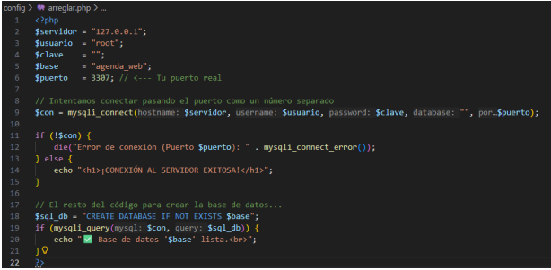

---

## 🗄 Base de Datos

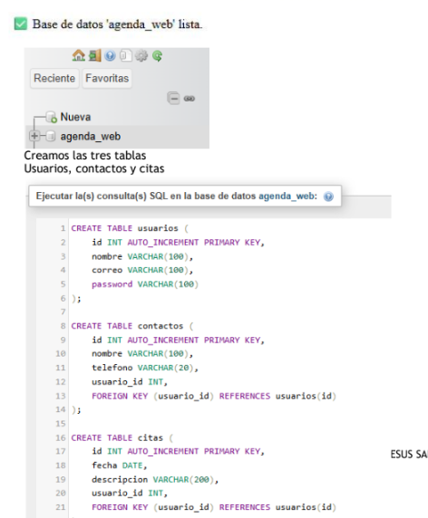

---

## 📅 Formulario citas.html

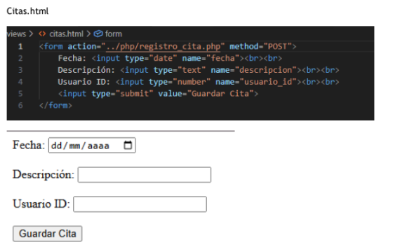

---

## 🔌 Conexión al Servidor

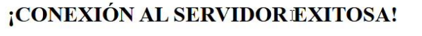

---

## 🔗 Archivo conexion.php

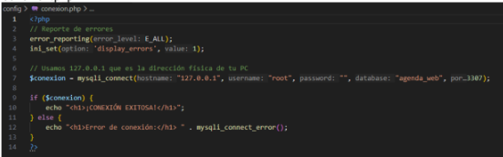

---

## 📞 Formulario contactos.html

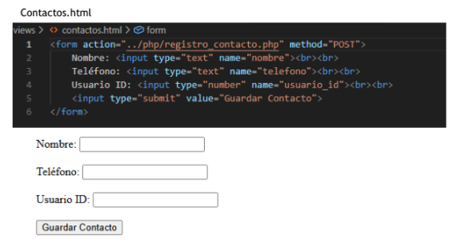

---

## 📝 Formularios Llenos

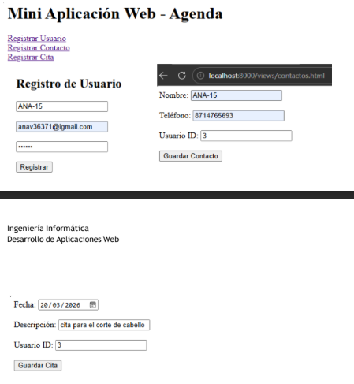

---

## 🏠 index.php

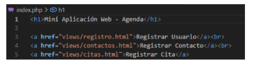

---

## 📅 Registro de Citas

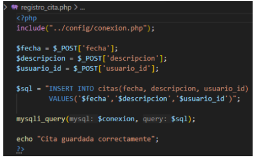

---

## 📞 Registro de Contactos

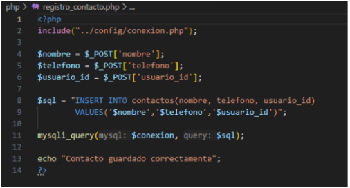

---

## 👤 Registro HTML

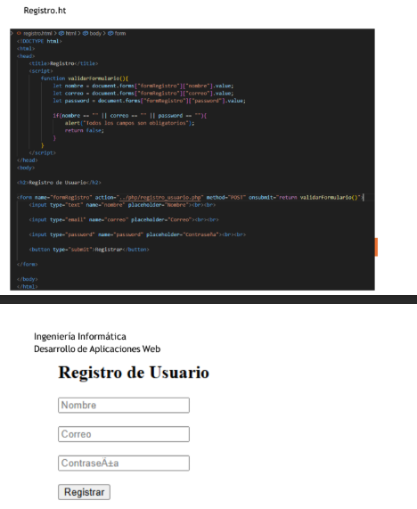

---

## 👥 Registro Usuarios

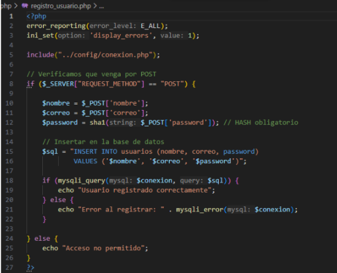

---

## ✅ Respuesta del Formulario

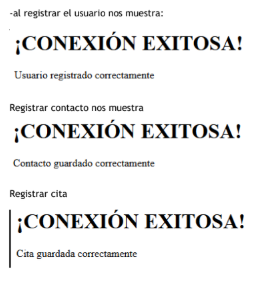

---

## 🗂 Tablas de Base de Datos

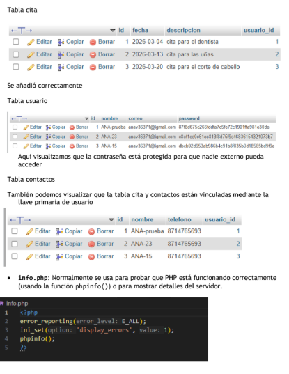
